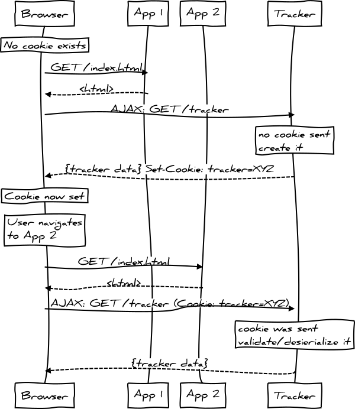

# auth0-anonymous-tracker

A cross-site anonymous user tracker.

## Usage

To use the tracker, web apps should load this script on all pages that require tracking:

```html
<script src="https://auth0-anonymous-tracker.herokuapp.com/tracker.js"></script>
```

The `getTracker` function can then be used to obtain the tracker data in a callback:

```js
getTracker(function (err, tracker) {
  console.log(tracker.id);
  // => d611bd81-8a02-4e85-aab4-752828bb0d85
});
```

Now any website that implements the above will return the same tracker data for the same user/browser.

## How it works



(made with [js-sequence-diagrams](http://bramp.github.io/js-sequence-diagrams/) with text in [sequence.txt](sequence.txt))

### App 1

* Initially no `tracker` cookie exists in the user's browser
* A user browses to the App 1 website, which downloads `index.html` and all the resources referenced within, including the `tracker.js` script from the Tracker website
* `tracker.js` contains the client-side SDK for interacting with Tracker, which includes the `getTracker` function
* When the page finishes loading, the App 1 client-side code calls the `getTracker` function in order to fetch the Tracker ID and display it on the page
* This performs an AJAX call to the `/tracker` endpoint in Tracker
* That endpoint will check for the existence of the `tracker` cookie in the request; but it won't exist, so it will create a new one with a new ID
* The endpoint will return the tracker data as well as transmit a new `tracker` cookie via the `Set-Cookie` response header.
* The cookie is HTTP only (can't be read by the browser) and its value is a [JWT](http://jwt.io) that has been signed by the server
* The call to the endpoint also requires [CORS](http://en.wikipedia.org/wiki/Cross-origin_resource_sharing) to be enabled in the Tracker app, allowing the `Origin` of App 1 as well as `Access-Control-Allow-Credentials` set to true so cookies can be passed

### App 2

* The user browses to App 2 and now the tracker cookie exists
* When App 2 calls the `/tracker` endpoint, it also sends the `tracker` cookie
* The endpoint detects the cookie, verifies and desierializes it (since its a JWT) using the same secret it used to create it initially
* The endpoint then returns the same data that was returned to App 1 since it came from the same cookie

## Try it

The Tracker app is hosted in Heroku: https://auth0-anonymous-tracker.herokuapp.com/

Check out the demo apps [app1](app1) and [app2](app2).

## Running the server

For the server to run, the `TRACKER_SECRET` environment variable needs to be exported. It can contain any value you want as its just use to create and verify the JWT that's stored in the tracker cookie.

To run locally, you can either export the `TRACKER_SECRET` and run the server:

```bash
export TRACKER_SECRET="this is a secret"
node server.js
```

Or use the `heroku local` command (if you have the [Heroku Toolbelt](https://toolbelt.heroku.com/) installed) and store the variable in a `.env` file:

```bash
echo "this is a secret" > .env
heroku local
```

To deploy the server, just make sure that same environment variable is configured on the provider. For example, on Heroku:

```bash
heroku config:add TRACKER_SECRET="this is a secret"
heroku open
```

## Considerations

* The Tracker app has CORS enabled to support the AJAX calls to the `/tracker` endpoint, but it currently allows *all* origins. A more secure configuration would be limit the origins to a whitelist.
* The [`getTracker`](tracker.js#L2) function performs the AJAX call to the `/tracker` endpoint *every* time it's invoked. As long as the tracker data is immutable (currently it only contains an `id`), you could cache this result (e.g. using cache control or local storage) to avoid the AJAX hit on every page request. You would just have to take care to invalidate that cache whenever the tracker cookie itself expires or is deleted.
* The `tracker` cookie value is a JWT. It's signed on the server (in the Tracker app) so it can be verified when its sent back to prevent tampering. However, the payload of the JWT itself is just base-64 encoded. An extra security step would be to encrypt that payload.
* The `tracker` cookie could also be [created](server.js#L45) with `secure: true` which would require that it only gets transmitted over HTTPS. See Express.js docs for [`res.cookie()`](http://expressjs.com/4x/api.html#res.cookie) for more info. You may want to drive this option from configuration as it would be tougher to test in localhost if this was on.
